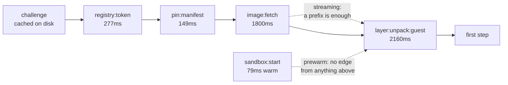

# Step breakdown

What a build spends, phase by phase, and - the point of the document - what each phase is
*waiting on*. Times size the parts; the constraints say which parts could ever move.

Read as dataflow. Every phase consumes values and produces one. Two phases may overlap
exactly when neither's output reaches the other's input; the critical path is the longest
chain of real edges. Nothing here is a wish - an edge is either in the code or it is not,
and where a phase is pinned by something softer than a data dependency this says so.

**Where the numbers come from.** `golang:1.24-alpine` for the prologue (one 75.4 MB layer,
15,741 entries, five layers) and a 40-step `alpine:3.22` build for the per-step figures.
macOS on Apple silicon, store on the guest's ext4 device, warm VM, ~24 MB/s to Docker Hub.
A different shape of build moves every number and none of the edges. Per-step noise is
about 28%, so per-step figures are best-of-three and only their *order* is load-bearing.

## 1. The values

The dataflow is over these. Everything else is bookkeeping about them.

| Value               | Produced by          | Consumed by                     |
| ------------------- | -------------------- | ------------------------------- |
| challenge           | first 401, cached    | `registry:token`                |
| bearer token        | `registry:token`     | `pin:manifest`, `image:fetch`   |
| digest + layer list | `pin:manifest`       | `plan`, `image:fetch`           |
| DAG                 | `plan`               | `schedule`                      |
| sandbox             | `sandbox:start`      | every guest call                |
| blob bytes          | `image:fetch`        | `layer:unpack:guest`            |
| layer id            | `layer:unpack:guest` | `materialise`                   |
| mount handle        | `materialise`        | `guest:bind`                    |
| bound rootfs        | `guest:bind`         | `guest:exec`                    |
| output + exit       | `guest:exec`         | `capture`, `guest:commit`       |
| step layer id       | `guest:commit`       | the *next* step's `materialise` |

The last row is the whole story of why a step is not very overlappable. See §5.

## 2. The prologue

Paid once per build, before any step can run.

| Phase                | Cost                       | Consumes     | Produces     | Overlaps today                     |
| -------------------- | -------------------------- | ------------ | ------------ | ---------------------------------- |
| `registry:token`     | 277-430ms                  | challenge    | bearer token | `warm`, credential helper, prewarm |
| `pin:manifest`       | 149-200ms                  | bearer token | digest       | prewarm                            |
| `plan`               | 427-580ms                  | digest       | DAG          | *is* the two above, near enough    |
| `sandbox:start`      | 79-110ms warm, 1590ms cold | -            | sandbox      | all of the above                   |
| `image:fetch`        | 1800-2010ms                | digest       | blob bytes   | `layer:unpack:guest`               |
| `image:unpack:guest` | 2759ms                     | blob bytes   | layer ids    | `image:fetch`                      |

`plan` is not a third cost. Its 427ms is 277 + 149 to within a millisecond: the
interpreter's own work is noise, and what `plan` measures is waiting for the registry.
Three lines that look like three costs are one round trip counted three ways - the same
trap E733 records, one level up.

### What pins the prologue



Four overlaps are already taken, and they are the reason the prologue is not the sum of
its parts:

- **the 401 is not paid** - the challenge is cached to disk, so the token exchange starts
  at the token request rather than a rejected manifest GET
- **`warm` pre-dials the registry** while the token is being fetched at a *different*
  host, so the manifest GET pays a request and not a TLS handshake (E535)
- **the credential helper resolves during the dial** - a Mac keychain is a process and
  ~59ms of one, and it lands before the exchange needs it rather than in front of it
- **the sandbox boots during all of it** - `Prewarm` has no input from anything above,
  which is exactly why it can start before the plan exists (E537)

What is left is `token → manifest`, and that edge is real: the manifest GET carries the
token. The only way to cut it is to not fetch a token, which means caching one - see §6.

## 3. One step

```mermaid
sequenceDiagram
    participant H as host
    participant G as guest
    Note over H: key · lookup · l2 · observe<br/>&lt;0.05ms each
    H->>H: exec:prep 1.9ms
    H->>G: Materialise(stack)
    Note over G: assemble the layer stack
    G-->>H: mount handle · 1.9ms
    H->>G: Run(handle, argv)
    Note over G: guest:prepare 1.2ms
    Note over G: guest:bind 1.0ms<br/>argv·proc·sys·cgroup·devpts<br/>·isolate·views·hold &lt;0.05ms
    Note over G: guest:exec 7.5ms<br/>fork/exec + syscall tracing
    G-->>H: output + exit · request 9.9ms
    H->>H: capture 1.5ms
    G->>G: guest:commit 1.0ms
    G->>G: guest:unbind 1.0ms<br/>(umount 0.6ms)
    Note over H: step total 16.1ms
```

The vsock round trip is `run` - `guest:request` = 0.5ms. Host bookkeeping outside the
guest call is `exec:prep` 1.9ms - which *contains* `materialise`, so do not add those two
together - plus `capture` 1.5ms. That leaves 2.3ms of the 5.7ms between `exec` and `run`
unattributed: `key`, `lookup`, `l2`, `observe` and `mat:stack` each round to nothing
individually, and there are five of them plus untimed glue.

### Per-step constraints

| Phase               | Cost    | Cannot start until          | Blocks             | Could it move?                         |
| ------------------- | ------- | --------------------------- | ------------------ | -------------------------------------- |
| `key` `lookup` `l2` | <0.05ms | the step's inputs are known | the cache decision | already free                           |
| `materialise`       | 1.9ms   | base layers unpacked        | `guest:bind`       | only by predicting the base - see §6   |
| `guest:prepare`     | 1.2ms   | the request arrives         | `guest:bind`       | handle lookup; nothing to overlap with |
| `guest:bind`        | 1.0ms   | `materialise`               | `guest:exec`       | no - the rootfs must exist to run in   |
| `guest:exec`        | 7.5ms   | `guest:bind`                | everything after   | this is the work                       |
| `capture`           | 1.5ms   | output exists               | the step's result  | **yes** - see §6                       |
| `guest:commit`      | 1.0ms   | `guest:exec` done           | the *next* step    | no - it produces the next base         |
| `guest:unbind`      | 1.0ms   | `guest:exec` done           | nothing            | **yes** - see §6                       |

## 4. What the numbers say about a whole build

| Build                         | Cost        | Composition                            |
| ----------------------------- | ----------- | -------------------------------------- |
| cold, one step                | ~4400ms     | prologue-dominated; steps are rounding |
| fully cached, any step count  | ~460ms flat | the prologue, and nothing else         |
| 40 uncached steps, warm image | ~982ms      | ~455ms fixed + 39 x 13.2ms             |

The middle row is the one to notice: a no-op rebuild costs the same at 1 step as at 40,
because the cache decision is `key → lookup → l2` and all three round to nothing. The
fixed 455ms of a no-op build is the prologue - which is to say, it is the registry.

## 5. Why a step is not very overlappable

Step *n*+1's base **is** step *n*'s committed layer. That is a data edge, not a scheduling
choice, and it makes a chain of `RUN`s strictly serial however many cores are idle.

What is already parallel:

- **independent steps**, bounded by `Parallelism` (NumCPU when zero). The scheduler is a
  DAG executor: `remaining` counts each node's unfinished inputs and `dependents` is the
  reverse edge, so anything with no path between it and the running work is already
  running too, and it works: 8 seconds of `sleep` offered as 80 steps across 16 targets
  completes in 1.3s, about 61% of what sixteen slots allow. What does not overlap is
  roughly **4ms of per-step overhead** - visible as a 175 steps/s ceiling when every step
  is `echo` and invisible when a step does real work (E812, E812a). That number is why
  shaving `bind` and `unbind` is worth more than it looks: they are 2.0ms of the 4ms that
  is not overlapping with anything.
- **layers within an image** - one goroutine per layer, each unpacking as its blob lands
  rather than after all of them have.
- **fetch against unpack** - available, but *off*. The guest can read a growing blob, so an
  unpack can start before the last byte arrives; turning it on starts the fault-in relay,
  which the guest reads as "this host can fault paths in", and on a local build nothing
  can. It was briefly the default and broke every build on macOS (E811).

So the overlap left inside a step is between host bookkeeping and guest work, and that is
8.6ms of a 16.1ms step. Most of it is pinned: `bind` must precede `exec` because the
process needs a rootfs, and `commit` must follow it because it produces the next base.

## 6. Headroom, honestly

Ranked by what is actually available, not by what would be nice.

| Candidate                      | Ceiling      | Constraint that decides it                    |
| ------------------------------ | ------------ | --------------------------------------------- |
| cache the bearer token         | ~277ms/build | none - the manifest GET still asks the origin |
| `unbind` off the critical path | ~1.0ms/step  | nothing consumes it; it is teardown           |
| `capture` against `commit`     | ~1.0ms/step  | disjoint inputs - output vs layer             |
| parallelise unpack writes      | ~450ms cold  | measured and rejected - see below             |
| cache the tag resolution       | ~149ms/build | rejected: correctness, see below              |
| overlap steps in a chain       | 0            | impossible - the layer edge is real           |

**Caching the token is the one real item.** It saves the whole `registry:token` round trip
for any build inside the token's life (Docker Hub issues ~300s), and it is orthogonal to
freshness: the manifest GET still happens, so the answer to "what does this tag mean
today" is still asked of the origin. It is not free of consequence - it writes a bearer
credential to disk, in an engine that otherwise goes out of its way never to hold one
(the interpreter is handed digests and never a value). That is a policy decision and it
is not taken here.

**Two things are rejected rather than pending.** Parallelising the file writes inside an
unpack saves under half a second on a cold build, in the one function that enforces Zip
Slip: on the guest's ext4, an unpack is 1.040s of inflate, 0.011s of tar walk and 0.589s
of writing - the write side only looked worth attacking because the first measurement was
taken on the host's APFS, which is 3.7x slower at creating files. And caching the
tag-to-digest resolution is deliberate: a resolution *is* the answer to what a tag means
today, `resolve.go` asks the origin on purpose, and anyone who would rather have the
149ms can pin by digest and skip the resolution entirely.

**The two per-step items are worth about 2ms of a 16.1ms step** and both are teardown or
disjoint work rather than anything on the chain. Worth having, not worth reaching for
first.

## 7. What would change these numbers

The measurements are a floor for *this* shape of build. Three things move them:

- **more layers, smaller** - the prologue's fetch and unpack parallelise across layers, so
  a many-layer image uses cores the single-big-layer case cannot
- **more independent targets** - the only real parallelism a build has; a wide DAG scales
  with NumCPU where a chain of `RUN`s does not
- **a worse link** - the prologue is registry-bound and nothing else is. A build measured
  at 77s and then at 7s on the same binary differed only in where the wifi router was
  standing, which is worth remembering before reading any prologue number as an engine
  number.
