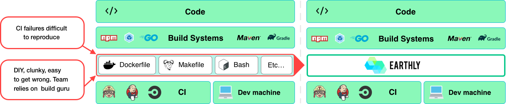

# Introduction

**Please note that Earthbuild is no longer actively maintained.** [Read more](https://earthbuild.dev/blog/shutting-down-earthfiles-cloud).

Earthbuild is a super simple CI/CD framework that gives you repeatable builds that you write once and run anywhere; has a simple, instantly recognizable syntax; and works with every language, framework, and build tool. With Earthbuild, you can create Docker images and build artifacts (e.g. binaries, packages, and arbitrary files).

Earthbuild can run locally or on top of popular CI systems – such as [Jenkins](./ci-integration/guides/jenkins.md), [CircleCI](./ci-integration/guides/circle-integration.md), [GitHub Actions](./ci-integration/guides/gh-actions-integration.md), [AWS CodeBuild](./ci-integration/guides/codebuild-integration.md), [Google Cloud Build](./ci-integration/guides/google-cloud-build.md), and [GitLab CI/CD](./ci-integration/guides/gitlab-integration.md). It typically acts as the layer between language-specific tooling (such as maven, gradle, npm, pip, and go build) and the CI build spec.

Earthbuild's key features/benefits are:

- **🔁 Repeatable Builds**
  Earthbuild runs all builds in containers, making them self-contained, isolated, repeatable, and portable. When you write a build, you know it will execute correctly no matter where it runs – your laptop, a colleague’s laptop, or any CI. You don’t have to configure language-specific tooling, install additional dependencies, or complicate your build scripts to ensure they are compatible with different OSs. Earthbuild gives you consistent, repeatable builds regardless of where they run.
- **❤️ Super Simple**
  Earthbuild’s syntax is easy to write and understand. Most engineers can read an Earthfile instantly, without prior knowledge of Earthbuild. We combined some of the best ideas from Dockerfiles and Makefiles into one specification *– like Dockerfile and Makefile had a baby*.
- **🛠 Compatible with Every Language, Framework, and Build Tool**
  One of the key principles of Earthbuild is that the best build tooling for a specific language is built by the community of that language itself. Earthbuild does not intend to replace any language-specific build tooling, but rather to leverage and augment them. Earthbuild works with the compilers and build tools you use. If it runs on Linux, it runs on Earthbuild. And you don’t have to rewrite your existing builds or replace your `package.json`, `go.mod`, `build.gradle`, or `Cargo.toml` files. You can use Earthbuild as a wrapper around your existing tooling and still get Earthbuild’s repeatable builds, parallel execution, and build caching.
- **🏘 Great for Monorepos and Polyrepos**
  Earthbuild is great for both [monorepos](https://github.com/earthbuild/earthbuild/tree/main/examples/monorepo) and [polyrepos](https://github.com/earthbuild/earthbuild/tree/main/examples/multirepo). You can split your build logic across multiple Earthfiles, placing some deeper inside the directory structure or even in other repositories. Referencing targets from other Earthfiles is easy regardless of where they are stored. So you can organize your build logic however makes the most sense for your project.
- **💨 Fast Builds**
  Earthbuild automatically executes build targets in parallel and makes maximum use of cache. This makes builds fast. Earthbuild also has powerful shared caching capabilities that speed up builds frequently run across a team or in sandboxed environments, such as Earthbuild Satellites, GitHub Actions, or your CI.
  &nbsp;
  If your build has multiple steps, Earthbuild will:
  1. Build a directed acyclic graph (DAG).
  2. Isolate execution of each step.
  3. Run independent steps in parallel.
  4. Cache results for future use.
- **♻️ Reuse, Don't Repeat**
  Never have to write the same code in multiple builds again. With Earthbuild, you can reuse targets, artifacts, and images across multiple Earthfiles, even ones in other repositories, in a single line. Earthbuild is cache-aware, based on the individual hashes of each file, and has shared caching capabilities. So you can create a vast and efficient build hierarchy that only executes the minimum required steps.

## Installation

The best way to install EarthBuild is by following the [installation instructions](https://earthbuild.dev/get-earthbuild).

For a full list of installation options see the [alternative installation page](./alt-installation/alt-installation.md).

## Getting started

If you are new to Earthbuild, check out the [Basics page](./basics/basics.md), to get started.

A high-level overview is available on [the Earthbuild GitHub page](https://github.com/earthbuild/earthbuild).

## Quick Links

- [Earthbuild GitHub page](https://github.com/earthbuild/earthbuild)
- [Earthbuild basics](./basics/basics.md)
- [Earthfile reference](./earthfile/earthfile.md)
- [Earthly command reference](./earthly-command/earthly-command.md)
- [Configuration reference](./earthly-config/earthly-config.md)
- [Earthfile examples](./examples/examples.md)
- [Best practices](./guides/best-practices.md)
