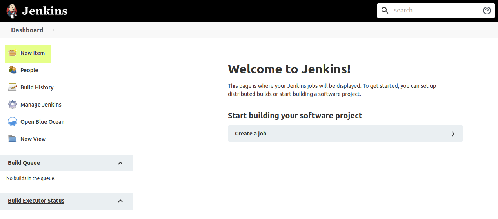
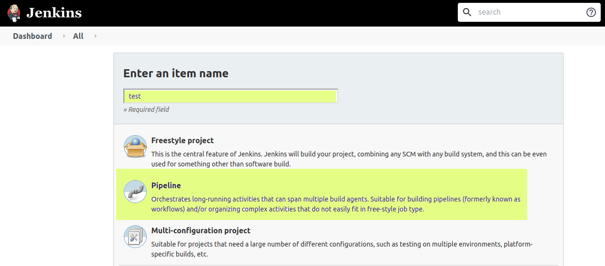
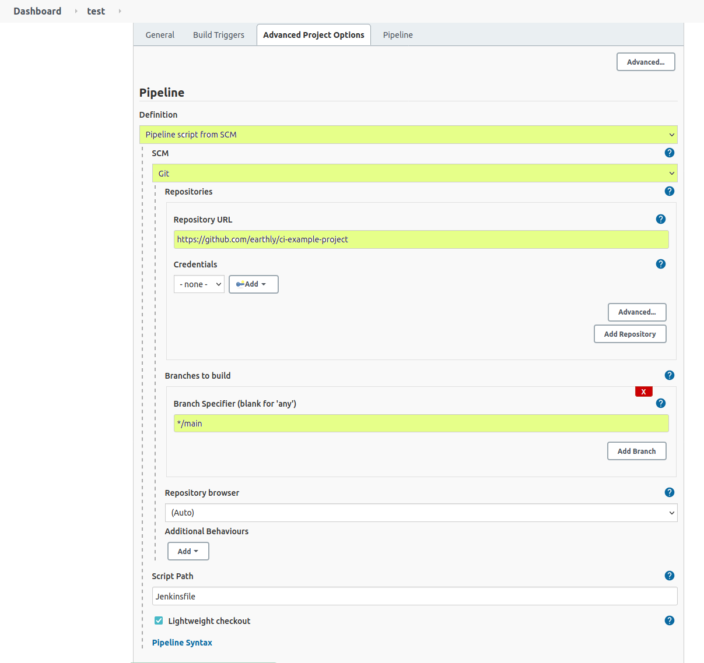
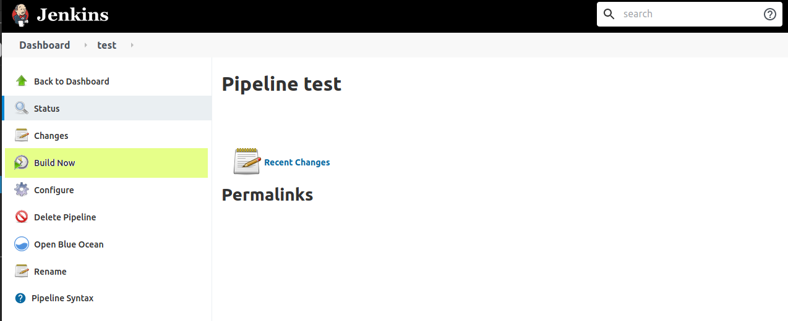
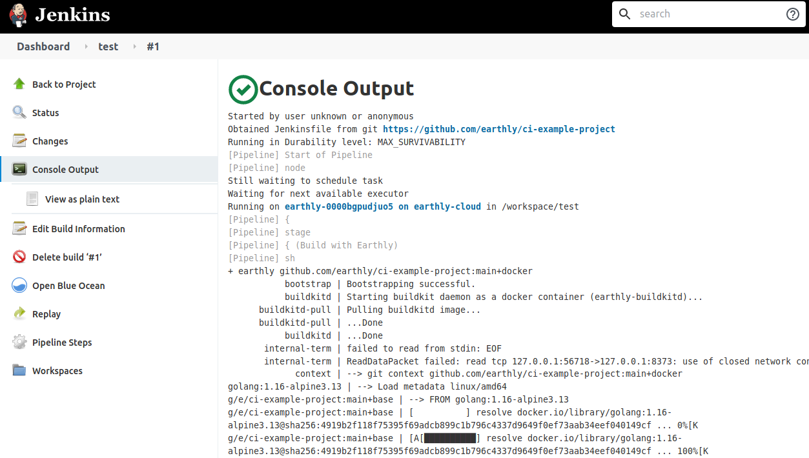
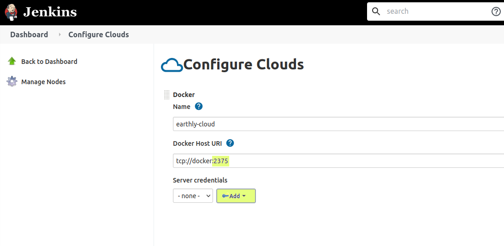

# Jenkins

## Overview

Jenkins has multiple modes of operation, and each of them require some consideration when installing EarthBuild. These modes include:

- Standalone, dedicated runners
- Ephemeral cloud runners

### Compatibility

EarthBuild has been tested with Jenkins in a standalone runner configuration, and using the Docker Cloud provider.

### Resources

- [Installing Jenkins](https://www.jenkins.io/doc/book/installing/)
- [Docker Cloud Plugin](https://plugins.jenkins.io/docker-plugin/)
- [Jenkins Credentials](https://www.jenkins.io/doc/book/using/using-credentials/)

## Setup (Standalone)

This should not differ in any meaningful way from the steps outlined in the [overview](../overview.md).

## Setup (Docker Cloud)

Assuming you are following the steps outlined in the [overview](../overview.md), here are the additional things you need to configure:

### Dependencies

Ensure that the Docker Cloud provider is installed and has a Docker daemon available. The Cloud provider does not provide a daemon.

### Installation

You'll need to [create your own runner image](../build-an-earthly-ci-image.md). Heres an example of what this might look like, when basing your runner off our `earthbuild/earthbuild` image:

```docker
ARG VERSION=4.9
RUN apk add --no-cache curl bash git git-lfs openssh-client openssl procps \
  && curl --create-dirs -fsSLo /usr/share/jenkins/agent.jar https://repo.jenkins-ci.org/public/org/jenkins-ci/main/remoting/${VERSION}/remoting-${VERSION}.jar \
  && chmod 755 /usr/share/jenkins \
  && chmod 644 /usr/share/jenkins/agent.jar \
  && ln -sf /usr/share/jenkins/agent.jar /usr/share/jenkins/slave.jar \
  && apk del curl
```

`VERSION` is the version of the Jenkins runner to install.

### Configuration

Set `DOCKER_HOST` to point at a Docker daemon. This can easily be passed through by checking "Expose Docker Host" in the runner template configuration.

## Additional Notes

`earth` misinterprets the Jenkins environment as a terminal. To hide the ANSI color codes, set `NO_COLOR` to `1`.

## Example



##### Note

This example is not production ready, and is intended to showcase configuration needed to get EarthBuild off the ground. If you run into any issues, or need help, [don't hesitate to reach out](https://github.com/earthbuild/earthbuild/issues/new)!



To try this locally you need a Jenkins server, a Docker daemon for the Docker Cloud
plugin to schedule agents on, and a repository containing an `Earthfile` and a `Jenkinsfile`.

### A local Jenkins server

Create a network, start a Docker-in-Docker daemon on it, then start Jenkins:

```bash
docker network create jenkins

docker run --detach --rm --privileged \
  --name jenkins-docker --network jenkins --network-alias docker \
  --env DOCKER_TLS_CERTDIR= \
  --publish 2375:2375 \
  docker:dind --storage-driver overlay2

docker run --detach --rm \
  --name jenkins-server --network jenkins \
  --env DOCKER_HOST=tcp://docker:2375 \
  --publish 8080:8080 --publish 50000:50000 \
  --volume jenkins-data:/var/jenkins_home \
  jenkins/jenkins:lts-jdk21
```

Then get the unlock password, and install the `docker-plugin` and `docker-workflow`
plugins through the setup wizard:

```bash
docker exec jenkins-server cat /var/jenkins_home/secrets/initialAdminPassword
```

Configure the Docker Cloud to point at `tcp://docker:2375`, using the runner image from
[Installation](#installation) above as the agent template.

### A pipeline to run

Add a `Jenkinsfile` alongside your `Earthfile`. A minimal starting point:

```groovy
pipeline {
    agent { label 'earth' }   // the label given to your Docker Cloud agent template
    environment {
        NO_COLOR = '1'        // see Additional Notes above
    }
    stages {
        stage('build') {
            steps {
                sh 'earth --ci +build'
            }
        }
    }
}
```

### Configuring the build

- Open Jenkins at [`http://localhost:8080`](http://localhost:8080/)
- Click "New Item", on the left



- Choose "Pipeline", give it a name (we chose "test"), and click "OK".



- Scroll down to the "Pipeline" section.
- Make the following changes:
- Choose "Pipeline script from SCM" for the Definition
- Choose "Git" as the SCM, once the option appears
- Set the repository URL to your own repository, the one containing the `Earthfile` and `Jenkinsfile`
- Set the branch specifier to `*/main`



- Once those changes are made, click "Save". Jenkins will navigate to the Pipelines' main page. Once there, click "Build Now"



- Find the build in your build history, and watch it go!



### Notes

To tear the environment down and start over:

```bash
docker rm -f jenkins-server jenkins-docker
docker volume rm jenkins-data
docker network rm jenkins
```

#### TLS

The example purposely runs a Docker-In-Docker (DIND) container without TLS for simplicity. This is *not* a recommended configuration. [Configuring TLS inside Docker.](https://docs.docker.com/engine/security/protect-access/#use-tls-https-to-protect-the-docker-daemon-socket)

To allow the `docker` client to access a daemon protected with TLS, you will need to add Jenkins credentials. Add the client key, certificate, and the server CA certificate as a credential. In our example, using the Docker Cloud provider, you can add them by choosing "Manage Jenkins", then "Manage Nodes and Clouds", and finally "Configure Clouds". Then, choose the cloud to configure for TLS, and click the "Add" button here:



Also, ensure that you are using the correct port for TLS. In this image of our example cloud, we are using port `2375`, which is traditionally the insecure port for a `docker` daemon. In a TLS environment, `docker` expects port `2376`.

If you are using an external `earth-buildkitd` with Jenkins, [you should be using mTLS](../remote-buildkit.md). You will need to add the keys and certificates used there as credentials too.
