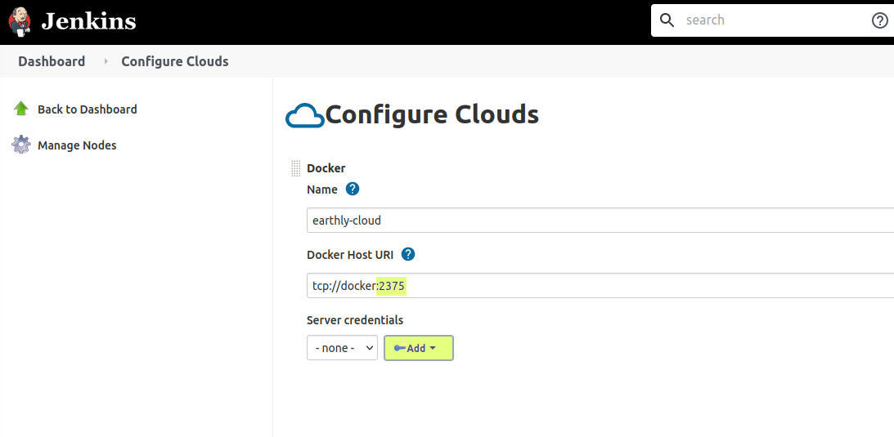

# Jenkins

## Overview

Jenkins has multiple modes of operation, and each of them require some consideration when installing earthbuild. These modes include:

 * Standalone, dedicated runners
 * Ephemeral cloud runners

### Compatibility

earthbuild has been tested with Jenkins in a standalone runner configuration, and using the Docker Cloud provider.

### Resources

 * [Installing Jenkins](https://www.jenkins.io/doc/book/installing/)
 * [Docker Cloud Plugin](https://plugins.jenkins.io/docker-plugin/)
 * [Jenkins Credentials](https://www.jenkins.io/doc/book/using/using-credentials/)

## Setup (Standalone)

This should not differ in any meaningful way from the steps outlined in the [overview](../overview.md).

## Setup (Docker Cloud)

Assuming you are following the steps outlined in the [overview](../overview.md), here are the additional things you need to configure:

### Dependencies

Ensure that the Docker Cloud provider is installed and has a Docker daemon available. The Cloud provider does not provide a daemon.

### Installation

You'll need to [create your own runner image](../build-an-earthbuild-ci-image.md). Heres an example of what this might look like, when basing your runner off our `earthbuild/earthbuild` image:

```docker
ARG VERSION=4.9
RUN apk add --update --no-cache curl bash git git-lfs openssh-client openssl procps \
  && curl --create-dirs -fsSLo /usr/share/jenkins/agent.jar https://repo.jenkins-ci.org/public/org/jenkins-ci/main/remoting/${VERSION}/remoting-${VERSION}.jar \
  && chmod 755 /usr/share/jenkins \
  && chmod 644 /usr/share/jenkins/agent.jar \
  && ln -sf /usr/share/jenkins/agent.jar /usr/share/jenkins/slave.jar \
  && apk del curl
```

`VERSION` is the version of the Jenkins runner to install.

### Configuration

Set `DOCKER_HOST` to point at a Docker daemon. This can easily be passed through by checking "Expose Docker Host" in the runner template configuration. 

## Additional Notes

`earthbuild` misinterprets the Jenkins environment as a terminal. To hide the ANSI color codes, set `NO_COLOR` to `1`.

## Example


##### Note

This example is not production ready, and is intended to showcase configuration needed to get earthbuild off the ground. If you run into any issues, or need help, [don't hesitate to reach out](https://github.com/earthbuild/earthbuild/issues/new)!



You can find our [Jenkins example on GitHub](https://github.com/earthbuild/ci-examples/tree/main/jenkins).

To run it yourself, clone the [`ci-examples` repository](https://github.com/earthbuild/ci-examples), and then run (from the root of the repository):

```go
earthbuild ./jenkins+start
```

This will start a local Jenkins server, minimally configured to spawn `earthbuild` builds using the Docker cloud plugin.

To run a build in this demo, you will need to configure a build pipeline. To do that, we have an [example project with a Jenkinsfile](https://github.com/earthbuild/ci-example-project). To configure the build pipeline for the example project:

- Open the Jenkins demo by going to [`http://localhost:8000`](http://localhost:8080/)
- Click "New Item", on the left


- Choose "Pipeline", give it a name (we chose "test"), and click "OK".


- Scroll down to the "Pipeline" section.
- Make the following changes:
    - Choose "Pipeline script from SCM" for the Definition
    - Choose "Git" as the SCM, once the option appears
    - Set the repository URL to [`https://github.com/earthbuild/ci-example-project`](https://github.com/earthbuild/ci-example-project)
    - Set the branch specifier to `*/main`


- Once those changes are made, click "Save". Jenkins will navigate to the Pipelines' main page. Once there, click "Build Now"


- Find the build in your build history, and watch it go!


### Notes

If you broke the example environment, you can run `earthbuild ./jenkins+cleanup` to clean up before trying to run again from scratch.

#### TLS

The example purposely runs a Docker-In-Docker (DIND) container without TLS for simplicity. This is *not* a recommended configuration. [Configuring TLS inside Docker.](https://docs.docker.com/engine/security/protect-access/#use-tls-https-to-protect-the-docker-daemon-socket)

To allow the `docker` client to access a daemon protected with TLS, you will need to add Jenkins credentials. Add the client key, certificate, and the server CA certificate as a credential. In our example, using the Docker Cloud provider, you can add them by choosing "Manage Jenkins", then "Manage Nodes and Clouds", and finally "Configure Clouds". Then, choose the cloud to configure for TLS, and click the "Add" button here:



Also, ensure that you are using the correct port for TLS. In this image of our example cloud, we are using port `2375`, which is traditionally the insecure port for a `docker` daemon. In a TLS environment, `docker` expects port `2376`.

If you are using an external `earthbuild-buildkitd` with Jenkins, [you should be using mTLS](../remote-buildkit.md). You will need to add the keys and certificates used there as credentials too.
